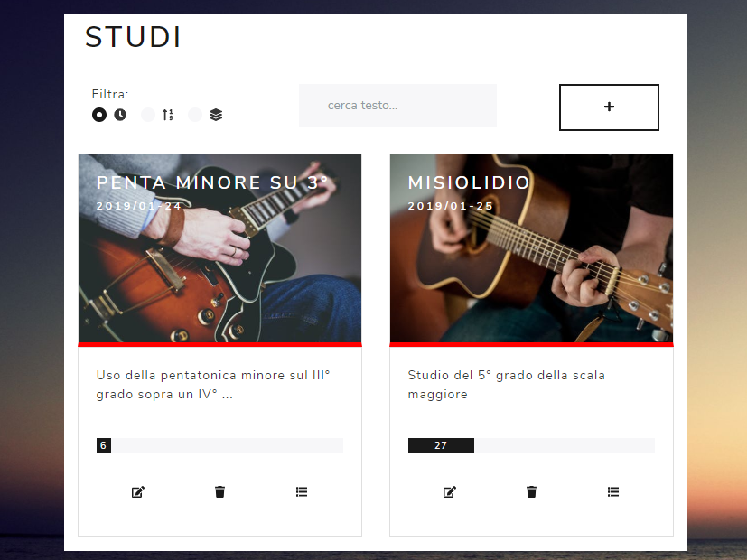

# VUE-FRETBOARD

Vue Fretboard, web app based and continuation of [notes-on-fretboard](https://github.com/LorenzoCorbella74/notes-on-fretboard), is able to organize the studies on the superimpositions of scales and arpeggios fingerings by displaying vertically guitar fretboards. The production of guitar fretboards is derived from the precious library [fretboard](https://github.com/txels/fretboard) based on [D3.js](https://d3js.org/).Vue Fretboard is optimised to be responsive up to ***550px*** so it can be used onsmartphones only with a "desktop" visualisation.
Guitar images courtesy of [Pexels](https://www.pexels.com) and for the image background courtesy of [Unsplash](https://unsplash.it).  For a demo please consider the [link](https://hardcore-liskov-9c3707.netlify.com/#/). 

## Features
- [x] can display fingerings according to tuning, root, scales or arpeggios 
- [x] labels with notes' names or degrees
- [x] can merge scale/arpeggios to have a graphical comparison of the notes in common and distint on each scale. 
- [x] can play guitar notes via [soundfont-player](https://github.com/danigb/soundfont-player)
- [x] responsive svg fretboards
- [x] draggable fretboards
- [x] Italian and English localisations

## Built With

### FE
- HTML5
- [ Vue.js 2](https://it.vuejs.org/)
- [Bootstrap 4](https://getbootstrap.com/) & [ Bootstrap Vue](https://bootstrap-vue.js.org) & [Pulse theme by Bootswatch ](https://bootswatch.com/pulse/)
- [Font Awesome](http://fontawesome.io)
- [D3.js](https://d3js.org/)
- [Vuelidate](https://github.com/monterail/vuelidate)
- [vue-i18n](https://github.com/kazupon/vue-i18n)
- [soundfont-player](https://github.com/danigb/soundfont-player)
### BE
- [Firebase Authentication and Cloud Firestore as DB](https://firebase.google.com/).

## License

This project is licensed under the MIT License.
